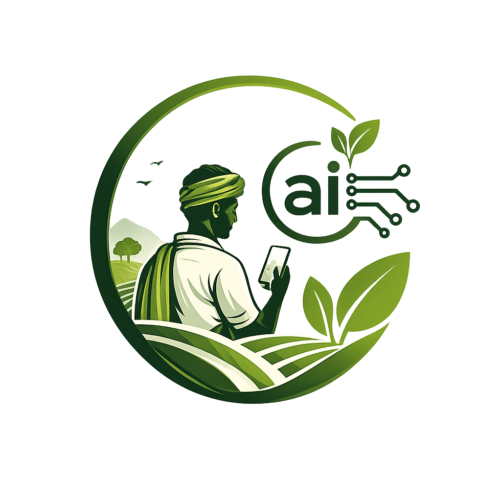



  
  <h1>🌾 Uzhavar AI V2</h1>
  
<strong>A Next-Generation, Voice-First AI Farm Assistant</strong>

 

## 🚀 Overview

**Uzhavar AI V2** is a massive upgrade to our award-winning hackathon project. It is designed to be the ultimate companion for farmers in Tamil Nadu (and across India), breaking down literacy and technological barriers by offering a **Voice-First** interface. 

The app listens to spoken questions in regional languages (including deep colloquial slang), processes them at lightning speed using advanced LLMs, and speaks the answer back in a highly natural, human-like voice.

## ✨ V2 Key Features

- **🎙️ Voice-First Architecture**: The app defaults to a beautiful, pulsing Voice Orb. Users don't need to know how to type—they just tap and speak.
- **🗣️ Native Regional Speech (Sarvam AI)**: 
  - **STT**: Accurately transcribes spoken Tamil, Hindi, and English, understanding complex farming terminology and local slang.
  - **TTS**: Utilizes Sarvam AI's ulbul:v3 model to read responses aloud in incredibly natural, premium South Indian voices (e.g., *Kavitha*), perfectly pronouncing tricky phonetic sounds.
- **⚡ Ultra-Fast Processing (Groq)**: Replaced local Ollama with Groq API, reducing response times from 30+ seconds to ~200ms, ensuring a fluid, conversational experience.
- **🎨 Apple-Style Minimalist UI**: Completely overhauled the visual identity from a dark theme to a premium, clean, highly legible Light Mode featuring glassmorphism elements, the sleek Outfit font, and cinematic farming illustrations.
- **📱 PWA & Mobile Optimized**: Fluid, app-like experience optimized for low-end devices and spotty network conditions.

## 🛠️ Tech Stack

- **Frontend**: React (Vite), Tailwind CSS, Vanilla CSS for custom animations.
- **AI / LLM**: Groq API (Llama 3 / Mixtral) customized with deep context prompts for agricultural data.
- **Voice APIs**: Sarvam AI (Speech-to-Text & Text-to-Speech).
- **Database & Auth**: Firebase (Anonymous Auth, Firestore for chat history).
- **Typography**: Google Fonts (Outfit, Noto Sans Tamil).

## 💻 Getting Started

### Prerequisites
- Node.js (v18+)
- API Keys for Groq, Sarvam AI, and Firebase.

### Installation
1. Clone the repository:
   `ash
   git clone https://github.com/yourusername/Uzhavar-ai-V2.git
   cd Uzhavar-ai-V2
   `
2. Install dependencies:
   `ash
   npm install
   `
3. Set up environment variables:
   Create a .env file in the root directory:
   `env
   VITE_GROQ_API_KEY=your_groq_key
   VITE_SARVAM_API_KEY=your_sarvam_key
   VITE_FIREBASE_API_KEY=your_firebase_key
   VITE_FIREBASE_AUTH_DOMAIN=your_domain
   VITE_FIREBASE_PROJECT_ID=your_project_id
   `
4. Run the development server:
   `ash
   npm run dev
   `

## 🎯 Presentation Ready
This V2 iteration was specifically architected to demonstrate the power of specialized, regional AI solutions in a live presentation setting, proving that cutting-edge technology can be made accessible to the grassroots agricultural sector.
